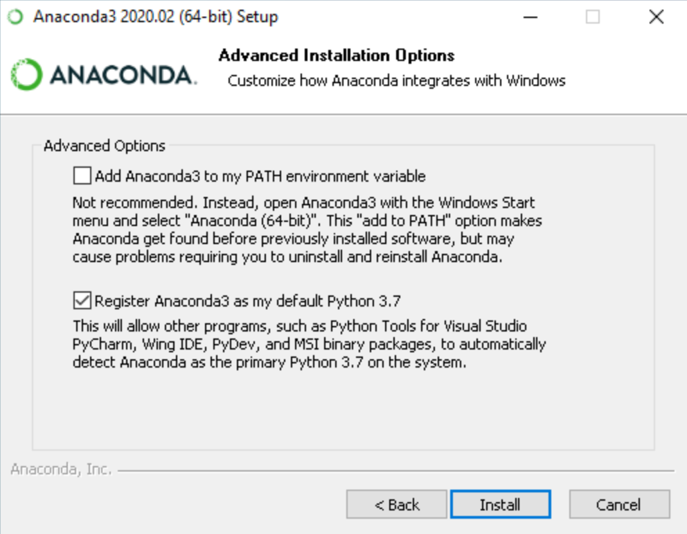
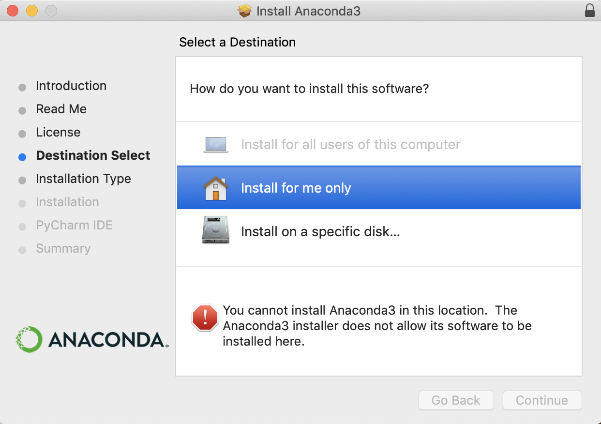

# How-to-Install-Anaconda

## Windows

1. Download the [Anaconda installer](https://www.anaconda.com/products/distribution#windows).

2. RECOMMENDED: [Verify data integrity with SHA-256](https://docs.anaconda.com/anaconda/install/hashes/). For more information on hashes, see [What about cryptographic hash verification?](https://conda.io/projects/conda/en/latest/user-guide/install/download.html#cryptographic-hash-verification)

3. Double click the installer to launch. 

4. Click Next.

5. Read the licensing terms and click “I Agree”.

6. Select an install for “Just Me” unless you’re installing for all users (which requires Windows Administrator privileges) and click Next.

7. Select a destination folder to install Anaconda and click the Next button.

8. Choose whether to add Anaconda to your PATH environment variable. We recommend not adding Anaconda to the PATH environment variable, since this can interfere with other software. Instead, use Anaconda software by opening Anaconda Navigator or the Anaconda Prompt from the Start Menu.

9. Choose whether to register Anaconda as your default Python. Unless you plan on installing and running multiple versions of Anaconda or multiple versions of Python, accept the default and leave this box checked.

10. Click the Install button. If you want to watch the packages Anaconda is installing, click Show Details.

11. Click the Next button.

12. After a successful installation you will see the “Thanks for installing Anaconda” dialog box:

## MacOS

1. Download the [graphical macOS installer](https://www.anaconda.com/products/distribution#macos) for your version of Python.

2. Double-click the downloaded file and click continue to start the installation.

3. Answer the prompts on the Introduction, Read Me, and License screens.

4. Click the Install button to install Anaconda in your ~/opt directory (recommended):

5. OR, click the Change Install Location button to install in another location (not recommended).

On the Destination Select screen, select Install for me only.

![](

